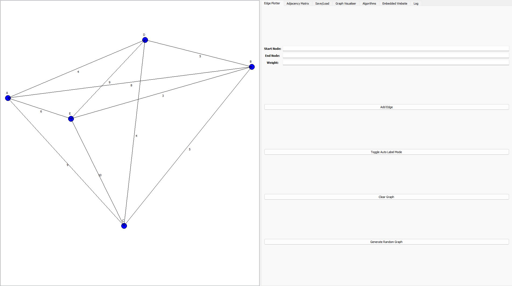

# OptiPath

This is my A-Level Computer Science NEA. The Travelling Salesman Problem didnt have many good resources online that actually let you see the algorithms running and compare them practically; most stuff is either academic papers or basic tutorials with no interactivity. I built this as a learning tool to fill that gap you can: create your own graphs, run different algorithms on them, and watch the solution animate in real time.



## Algorithms included

- **Exact** - Brute Force, Held-Karp
- **Approximation** - Christofides
- **Local Search** - 2-Opt, 3-Opt, Lin-Kernighan
- **Heuristic** - Nearest Neighbour, Nearest/Farthest/Cheapest/Random Insertion
- **Metaheuristic** - Ant Colony Optimisation, Randomised Local Search

## Running

```bash
pip install -r requirements.txt
cd src
python graphPlot.py   # just the graph tool, no account needed
python main.py        # full app with login and embedded site
```

Set `OPTIPATH_EMAIL` and `OPTIPATH_EMAIL_PASSWORD` as environment variables to enable email verification in the main app.

## Showcase Video

https://youtu.be/jf3JTOyoTRA
